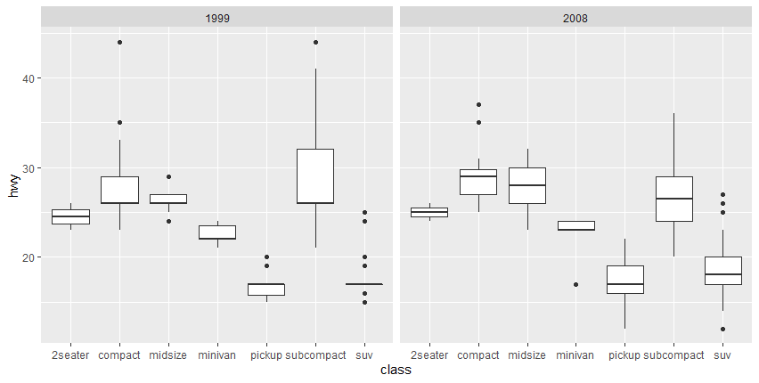
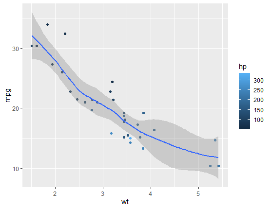

```{r setup, include=FALSE}
library(learnr)
library(tidyverse)
knitr::opts_chunk$set(echo = FALSE)
```

## Ejercicio 1

Empleando el paquete de datos _mpg_, **trata de escribir el código necesario para replicar las siguientes gráficas**:


```{r grafica1, exercise=TRUE, exercise.lines = 7}

```

```{r grafica1-hint-1}

"El esquema general que hemos usado para representar todas las gráficas hasta ahora:"

ggplot(data = DATOS) + 
  FUNCION_GEOM(mapping = aes(VARIABLES))

```

```{r grafica1-hint-2}

"El esquema general que hemos usado para representar todas las gráficas hasta ahora:"

ggplot(data = DATOS) + 
  FUNCION_GEOM(mapping = aes(VARIABLES))


"Al estar la gráfica separada en dos, prueba a usar la función facet_wrap():"

ggplot(data = DATOS) + 
  FUNCION_GEOM(mapping = aes(VARIABLES)) +
  facet_wrap(~ VARIABLE)

```

```{r grafica1-hint-3}

"El esquema general que hemos usado para representar todas las gráficas hasta ahora:"

ggplot(data = DATOS) + 
  FUNCION_GEOM(mapping = aes(VARIABLES))


"Al estar la gráfica separada en dos, prueba a usar la función facet_wrap():"

ggplot(data = DATOS) + 
  FUNCION_GEOM(mapping = aes(VARIABLES)) +
  facet_wrap(~ VARIABLE)


"Te recuerdo algunos de las diferentes funciones _geom_ para que puedas usarlas:"

- geom_point()
- geom_smooth()
- geom_bar()
- geom_col()
- geom_boxplot()

```

```{r grafica1-solution}

"El esquema general que hemos usado para representar todas las gráficas hasta ahora:"

ggplot(data = DATOS) + 
  FUNCION_GEOM(mapping = aes(VARIABLES))


"Al estar la gráfica separada en dos, prueba a usar la función facet_wrap():"

ggplot(data = DATOS) + 
  FUNCION_GEOM(mapping = aes(VARIABLES)) +
  facet_wrap(~ VARIABLE)


"Te recuerdo algunos de las diferentes funciones _geom_ para que puedas usarlas:"

- geom_point()
- geom_smooth()
- geom_bar()
- geom_col()
- geom_boxplot()


"SOLUCIÓN:"

ggplot(data = mpg) +
  geom_boxplot(aes(x = class, y = hwy)) +
  facet_wrap(~ year)

```

## Ejercicio 2

Para este ejercicio, vamos a utilizar _mtcars_, un set de datos implementado en R base y que es muy similar a _mpg_.

Empleando este paquete de datos y todo lo que has aprendido hasta ahora, **trata de escribir el código necesario para replicar las siguientes gráficas**:



```{r grafica2, exercise=TRUE, exercise.lines = 7}

```

```{r grafica2-hint-1}
"Esta representación parece estae compuesta por dos tipos diferentes de gráficos.
Recuerda que puedes representarlos por capas de la siguiente forma:"

ggplot(data = DATOS) + 
  FUNCION_GEOM_1(mapping = aes(VARIABLES)) +
  FUNCION_GEOM_2(mapping = aes(VARIABLES))
  
```

```{r grafica2-hint-2}

"Esta representación parece estar compuesta por dos tipos diferentes de gráficos.
Recuerda que puedes representarlos por capas de la siguiente forma:"

ggplot(data = DATOS) + 
  FUNCION_GEOM_1(mapping = aes(VARIABLES)) +
  FUNCION_GEOM_2(mapping = aes(VARIABLES))


"SOLUCIÓN:"

ggplot(data = mtcars) + 
  geom_point(mapping = aes(x = wt, y = mpg, color = hp)) + 
  geom_smooth(mapping = aes(x = wt, y = mpg))

```
